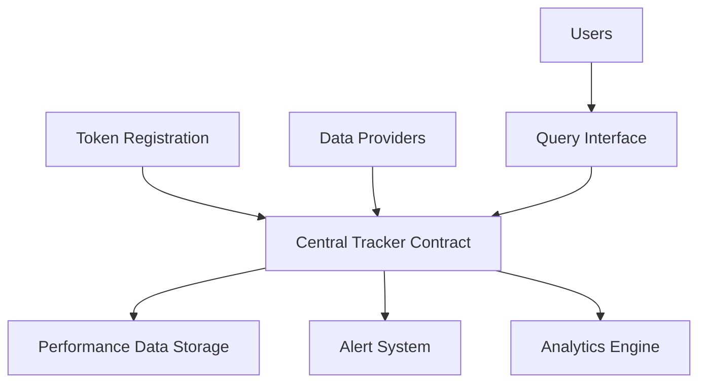

# TokenMark Performance Tracker

A decentralized platform for tracking, analyzing, and comparing token performance on the Stacks blockchain.

## Overview

TokenMark provides a comprehensive solution for monitoring and analyzing token performance on the Stacks blockchain. The platform enables:

- Token registration and tracking
- Historical price and performance data storage
- Performance alerts and monitoring
- Comparative token analysis
- Decentralized data provision through authorized providers

## Architecture

The platform is built around a central tracking contract that manages token registration, data storage, and analytics functionality.



### Core Components
- Token Registry: Maintains metadata for tracked tokens
- Performance Data Store: Historical price and volume data
- Alert System: User-configurable performance monitoring
- Analytics Engine: Comparative analysis and historical data processing
- Data Provider Network: Authorized entities submitting performance data

## Contract Documentation

### TokenMark Tracker (`tokenmark-tracker.clar`)

The main contract handling all platform functionality.

#### Key Features
- Token registration and management
- Performance data storage and retrieval
- User alerts and monitoring
- Data provider authorization
- Comparative analytics

#### Access Control
- Contract Owner: Can manage data providers and transfer ownership
- Data Providers: Can submit performance data
- Token Registrants: Can update their token's metadata
- Users: Can create and manage alerts, query data

## Getting Started

### Prerequisites
- Clarinet
- Stacks wallet for interaction
- Data provider authorization (for data submission)

### Basic Usage

1. Register a token:
```clarity
(contract-call? .tokenmark-tracker register-token 
    "token-id" 
    "Token Name" 
    "TKN" 
    "Description" 
    "ft" 
    'SP2PABAF9FTAJYNFZH93XENAJ8FVY99RRM50D2JG9)
```

2. Query token data:
```clarity
(contract-call? .tokenmark-tracker get-latest-token-data "token-id")
```

3. Create an alert:
```clarity
(contract-call? .tokenmark-tracker create-alert 
    "token-id" 
    "price-above" 
    1000)
```

## Function Reference

### Public Functions

#### Token Management
- `register-token`: Register a new token for tracking
- `update-token-metadata`: Update token information
- `deactivate-token`: Disable token tracking

#### Data Operations
- `submit-performance-data`: Submit new performance data point
- `get-token-history`: Retrieve historical performance data
- `compare-tokens`: Compare performance of two tokens

#### Alert System
- `create-alert`: Create new performance alert
- `deactivate-alert`: Disable an existing alert
- `get-user-alerts`: Retrieve user's alerts

#### Administration
- `set-data-provider`: Authorize/manage data providers
- `transfer-ownership`: Transfer contract ownership

### Read-Only Functions
- `get-token-metadata`: Retrieve token information
- `get-all-tokens`: List all registered tokens
- `get-latest-token-data`: Get most recent performance data
- `is-data-provider`: Check if address is authorized provider

## Development

### Testing
Run tests using Clarinet:
```bash
clarinet test
```

### Local Development
1. Clone the repository
2. Install Clarinet
3. Deploy contracts using Clarinet console:
```bash
clarinet console
```

## Security Considerations

### Data Provider Authorization
- Only authorized providers can submit performance data
- Authorization managed by contract owner
- Regular validation of provider credentials recommended

### Rate Limiting
- Consider transaction rate limits for data submission
- Monitor alert creation to prevent spam

### Data Validation
- Performance data should be validated before submission
- Historical data points are immutable once recorded
- Price manipulation detection recommended

### Access Control
- Token metadata updates restricted to registrant/owner
- Alert management restricted to alert creator
- Contract administration functions restricted to owner